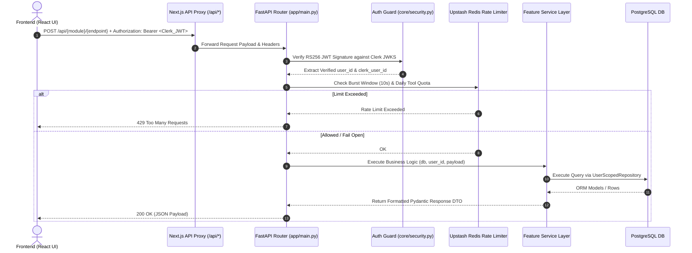

# 🔄 API Architecture & Workflows Master Reference

**Document Version:** 2.0.0  
**Status:** Production Baseline  

---

## 1. Request Lifecycle & Routing Architecture

The FastAPI backend serves as a modular monolith. All incoming requests pass through the Next.js API proxy (`/api/*`), which forwards calls to FastAPI.

---

## 2. API Routing Table

Every router is registered in `apps/api/app/main.py` with explicit tag and URL prefixes:

| Prefix | Router Module | Responsibilities & Description |
| :--- | :--- | :--- |
| `/api/job-search` | `job_search.routes` | Multi-provider job search (`/search`), applications tracking (`/applications`). |
| `/api/startup-hunt` | `startup_hunt.routes` | Startup discovery (`/search`), saved opportunities, contact listing, ATS source resolution (`/sources/resolve`). |
| `/api/startup-scout` | `startup_scout.routes` | AI startup scouting (`/search`), company saved lists (`/companies`), deep enrichment (`/companies/{id}/enrich`). |
| `/api/tracker` | `tracker.routes` | Follow-up tracker job applications CRUD (`/applications`). |
| `/api/email` & `/api/campaigns` | `bulk_email.routes` | Email campaign management, recipient import, async send queueing. |
| `/api/templates` | `templates.routes` | User message template management (`/templates`). |
| `/api/profile` | `profile.routes` | User profile CV fields, Cloudinary photo upload (`/avatar`, `/cv-photo`). |
| `/api/scrape` | `linkedin_fill.routes` | RapidAPI / PhantomBuster LinkedIn profile scraper & cache lookup. |
| `/api/ai` | `cover_letter.routes` | AI Cover Letter generation. |
| `/api/ai` | `interview_prep.routes` | AI Interview Prep document generation. |
| `/api/ai` | `salary.routes` | AI Salary Insights generator. |
| `/api/ai` | `resume_tailor.routes` | AI Resume Tailoring engine. |
| `/api/auth` | `auth.routes` | Clerk webhook sync (`/webhooks/clerk`). |
| `/api/usage` | `usage.routes` | Tool usage metrics and event tracking. |
| `/api/admin` | `admin.routes` | Admin platform analytics and management. |
| `/api/health` | `main.py` | Healthcheck endpoint (`{"status": "ok"}`). |

---

## 3. Rate Limits & Quotas (Config Baseline)

Configured in `app/core/config.py` via Redis token buckets:

| Tool / Action | Daily Limit (`rate_limit_*_per_day`) | Burst Window Limit |
| :--- | :--- | :--- |
| **Recent Job Search** | 10 searches / day | 3 requests / 10 sec |
| **Job Search Applications** | 200 updates / day | - |
| **Startup Hunt** | 8 searches / day | 3 requests / 10 sec |
| **Startup Scout** | 20 searches / day | 3 requests / 10 sec |
| **LinkedIn Scrape** | 10 profile scrapes / day | - |
| **Resume Tailor** | 5 tailoring runs / day | - |
| **Cover Letter** | 5 generations / day | - |
| **Interview Prep** | 10 preps / day | - |
| **Salary Insights** | 5 searches / day | - |
| **Bulk Email** | 500 per campaign / 3000 per month | Max 5 sends / sec |

---

## 4. API Reference Specifications

For detailed REST endpoints, request bodies, and error response schemas, see:

- 📡 [Recent Job Search API Reference](file:///d:/Projects/Vibe%20Code/quickjob-ai-job-search-automation-platform/docs/recent_job_search/api_reference.md)
- 📡 [Startup Hunt API Reference](file:///d:/Projects/Vibe%20Code/quickjob-ai-job-search-automation-platform/docs/startup_hunt/api_reference.md)
- 📡 [Startup Scout API Reference](file:///d:/Projects/Vibe%20Code/quickjob-ai-job-search-automation-platform/docs/startup_scout/api_reference.md)
