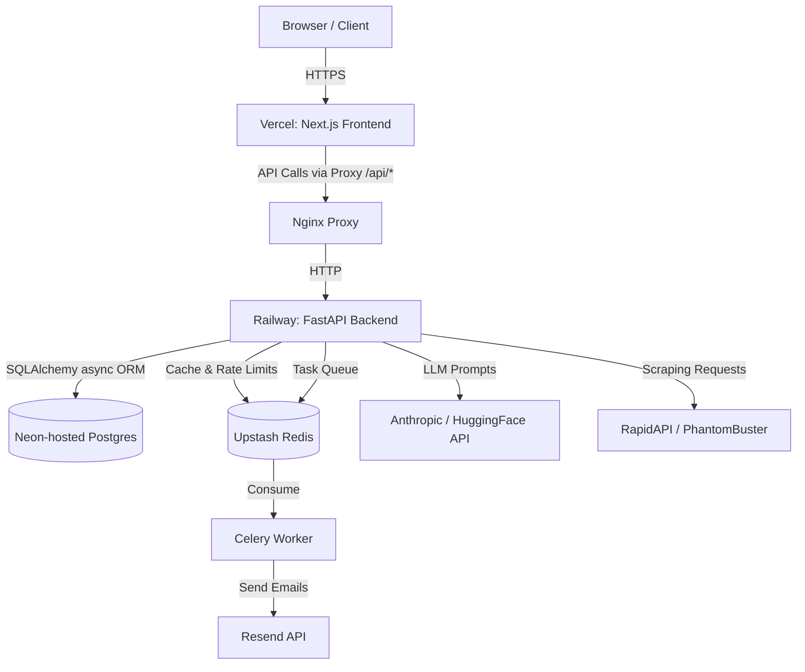

# 🏗️ System Architecture

JobNok is built on a modern, distributed architecture designed for high performance, scalability, and cost efficiency (currently free-tier optimized). The system strictly separates the user interface from business logic, utilizing a robust stack of Next.js, FastAPI, Neon, Clerk (Auth), Supabase (Storage), Redis, and Celery.

## High-Level Architecture Diagram

## Core Components

### 1. Frontend (Next.js 14)
- **Role:** Pure User Interface. Handles rendering, state management, and user interactions.
- **Responsibilities:**
  - Client-side routing.
  - Clerk Auth integration (JWTs, OAuth).
  - Proxying API requests (`/api/*` routes) to the API to avoid CORS issues and obscure backend URLs.
- **Tech:** React, Tailwind CSS, shadcn/ui, Zustand, React Hook Form + Zod.
- **Deployment:** Vercel.

### 2. Backend (FastAPI, modular monolith)
- **Role:** Central business logic hub. All heavy computations and external integrations happen here.
- **Structure:** `apps/api/app/` — one module per feature under `app/modules/<feature>/` (`routes.py`, `service.py`, `schemas.py`, `models.py`), plus shared `core/`, `shared/`, `ai/`, `integrations/`, `services/`, `workers/`.
- **Responsibilities:**
  - Handling business workflows (e.g., resume tailoring, cover letter generation).
  - Interacting with AI Providers (Anthropic, HuggingFace).
  - Executing scraping logic (LinkedIn profiles via RapidAPI).
  - Enforcing server-side rate limits using Redis.
  - Data access via SQLAlchemy async ORM + Alembic migrations (not a Supabase query client).
- **Tech:** Python 3.12, FastAPI, Pydantic (validation), SQLAlchemy + Alembic.
- **Deployment:** Railway.

### 3. Proxy (Nginx)
- **Role:** Reverse Proxy.
- **Responsibilities:** In Docker/production setups, Nginx is used to safely route `/api` traffic directly to the FastAPI container, providing an additional layer of security and load balancing capabilities.

### 4. Database (Neon) & Auth (Clerk)
- **Role:** Neon hosts Postgres; Clerk is the authentication provider (JWT/OAuth) — it is not the database host. A Clerk webhook (`app/modules/auth/routes.py`) keeps the `profiles` table's `clerk_user_id` mapping in sync with Clerk-side identity changes.
- **Responsibilities:**
  - Managing user sessions via JWT (verified in `app/core/security.py` against Clerk's JWKS — pure crypto/claims verification, no Clerk SDK dependency on the backend).
  - Storing user data, templates, job applications, and email campaigns, accessed via SQLAlchemy async ORM against Neon.
  - Enforcing **user_id scoping at the application layer**: every SQLAlchemy query goes through `UserScopedRepository` (`app/shared/repository.py`), which requires an explicit `user_id` filter. There is no Row Level Security, no PostgREST, and no `authenticated`/`anon`/`service_role` Postgres roles — the app connects with a single ordinary role, so app-level filtering is the sole enforcement mechanism, not a backstop alongside anything else.

### 5. Cache & Queues (Redis via Upstash)
- **Role:** High-speed in-memory datastore.
- **Responsibilities:**
  - **Rate Limiting:** Enforcing per-user limits on tool usage (sliding window, reset midnight UTC).
  - **Celery Broker:** Managing background task queues for asynchronous operations like bulk email sending.

### 6. Background Workers (Celery)
- **Role:** Asynchronous task processing.
- **Responsibilities:** Handling long-running or batch tasks (e.g., sending bulk emails via Resend with configured delays) so that the FastAPI main thread is never blocked.

## Security Principles

- **Zero Hardcoding:** All configurations, model names, and keys are injected via environment variables.
- **Strict Validation:** Inputs are validated on the client (Zod) and re-validated on the server (Pydantic).
- **Secure Data Access:** Every backend endpoint requires a valid JWT. The FastAPI service layer's explicit `user_id` filtering (via `UserScopedRepository`) is what enforces that users can only read and mutate their own rows — there is no Row Level Security layered underneath it; this is the sole enforcement mechanism.
- **Fail Gracefully:**
  - If a scraper fails, the system falls back to manual entry or cached data.
  - If an AI provider timeouts, automatic retries are triggered.
  - If Redis goes down, the rate limiter fails open (allows requests) rather than crashing the system.
