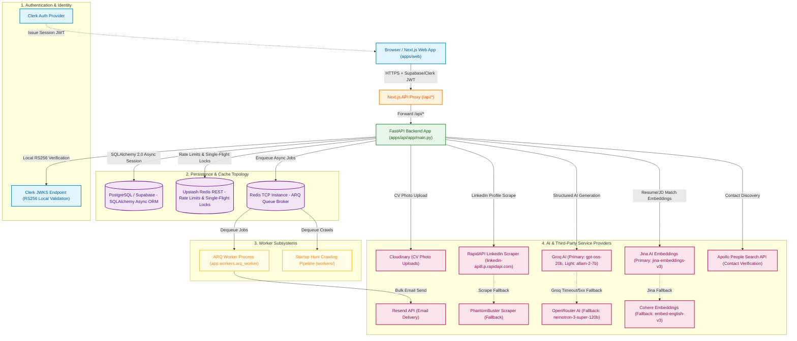

# 🏗️ Platform System Architecture — Master Reference (HLD)

**Document Version:** 2.0.0  
**Status:** Production Baseline  
**Target Audience:** Staff Engineers, Lead Architects, Infrastructure & Security Engineers  

---

## 1. High-Level System Architecture & Topography

The platform is engineered as a high-throughput, modular monolith backend paired with a Next.js 14 single-page web client. It orchestrates real-time multi-provider job search, automated ATS startup crawling, executive contact discovery, AI content generation, and bulk email campaign delivery.

---

## 2. Core Subsystem Architecture

### 2.1 Web Frontend (`apps/web`)
- **Framework**: Next.js 14 App Router with React Server Components.
- **Client Validation & UI**: React Hook Form with Zod schemas, styled via Tailwind CSS & shadcn/ui.
- **API Proxy**: Next.js server rewrites route `/api/*` requests to backend instance (`http://localhost:8000` or production API URL), securing backend origin URLs.

### 2.2 Modular Monolith Backend (`apps/api`)
- **Framework**: FastAPI (Python 3.12) running on Uvicorn.
- **Composition Root**: `apps/api/app/main.py` registers all 16 feature module routers (`job_search`, `startup_hunt`, `startup_scout`, `tracker`, `bulk_email`, `templates`, `profile`, `auth`, `usage`, `admin`, `cover_letter`, `interview_prep`, `salary`, `resume_tailor`, `linkedin_fill`).
- **Data Access Pattern**: SQLAlchemy 2.0 Async Session (`asyncpg` driver). Tenant isolation enforced at the service layer by `UserScopedRepository` (`app/shared/repository.py`), requiring an explicit `user_id` filter on every query.

### 2.3 AI & Embedding Multi-Provider Fallback Architecture
- **Primary AI Provider**: **Groq** (`groq_model="openai/gpt-oss-20b"`, `groq_light_model="allam-2-7b"` for prompt extraction).
- **Fallback AI Provider**: **OpenRouter** (`openrouter_model="nvidia/nemotron-3-super-120b-a12b:free"`, triggered on Groq rate limits, 5xx errors, or timeouts).
- **Embedding Layer**: **Jina AI** (`jina-embeddings-v3`) with fallback to **Cohere** (`embed-english-v3.0`) for semantic resume/JD scoring.

### 2.4 Caching, Concurrency & Rate Limiting
- **Dual Redis Infrastructure**:
  1. **Upstash Redis REST**: Enforces sliding/fixed window per-user daily rate limits (reset at 00:00 UTC), burst protection (10s window), and Redlock single-flight cache locks (`acquire_lock()`).
  2. **TCP Redis**: Acts as the message broker for background task execution (ARQ).
- **Fail-Open Policy**: If Redis is unreachable, rate-limit checks fail open to prevent application outages.

---

## 3. Dedicated Tool Subsystem Architecture

Specific feature tools maintain dedicated production documentation packages in their `docs/` subdirectories:

1. 📂 [Recent Job Search Architecture](file:///d:/Projects/Vibe%20Code/quickjob-ai-job-search-automation-platform/docs/recent_job_search/architecture_hld.md)
   - Real-time job search across Adzuna, Bundesagentur für Arbeit, and Arbeitnow bonus pipeline.
   - Word-boundary title relevance scoring, strict country isolation, and fingerprint deduplication.

2. 📂 [Startup Hunt Architecture](file:///d:/Projects/Vibe%20Code/quickjob-ai-job-search-automation-platform/docs/startup_hunt/architecture_hld.md)
   - Multi-ATS job board crawler (Greenhouse, Lever, Ashby, Personio, Workable).
   - SSRF protection layer (`ssrf_guard.py`), DNS pinning, and async background workers (`discovery_worker`, `resolution_worker`, `sync_worker`).

3. 📂 [Startup Scout Architecture](file:///d:/Projects/Vibe%20Code/quickjob-ai-job-search-automation-platform/docs/startup_scout/architecture_hld.md)
   - AI startup intelligence engine querying DuckDuckGo HTML endpoints.
   - Domain noise blacklist (`_NEWS_DOMAINS`) and Apollo API executive contact discovery.

---

## 4. Production Hardening & Operational Safeguards

1. **Alembic Single Authority**: All schema DDL changes strictly flow through Alembic migrations (`apps/api/alembic/versions/`).
2. **SSRF Guarding**: All third-party URL fetching passes through `SafeHTTPClient`, blocking private IP ranges (`10.0.0.0/8`, `172.16.0.0/12`, `192.168.0.0/16`) and metadata endpoints (`169.254.169.254`).
3. **Database Triggers**: Automatic `updated_at` column timestamp management via Postgres `set_updated_at()` trigger function.
