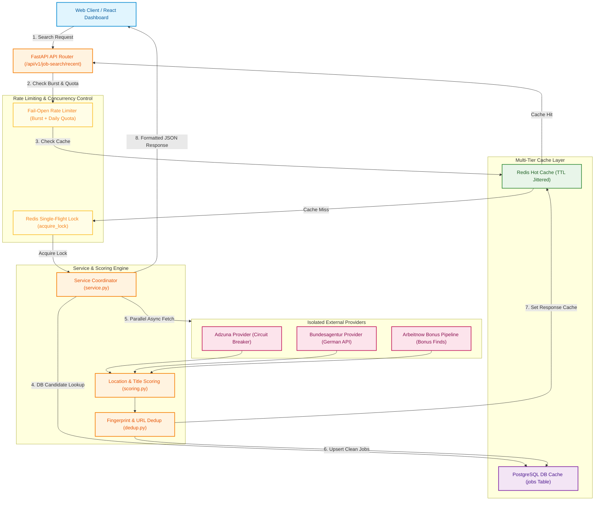

# Recent Job Search — High-Level Architecture (HLD)

**Document Version:** 2.0.0  
**Status:** Approved for Production  
**Target Audience:** Staff Engineers, Systems Architects, Backend Engineers  

---

## 1. Executive Overview

**Recent Job Search** is the platform's multi-provider real-time job discovery engine. It aggregates, filters, ranks, and deduplicates job postings across disparate international and regional providers (Adzuna, Bundesagentur für Arbeit, and Arbeitnow bonus pipeline) with high availability and sub-second latency.

### Key Architectural Objectives
1. **Low Latency & High Throughput**: Multi-tiered caching (Redis hot cache + PostgreSQL cold cache) with single-flight concurrency locking to prevent cache stampedes.
2. **Resilience & Fault Isolation**: Multi-provider registry with per-provider circuit breakers, daily tool budgets, and fail-open rate limiters.
3. **Data Precision**: Strict location and country matching with word-boundary title keyword scoring to eliminate cross-border result leaks.
4. **Application Tracking Integration**: Native link to user application status tracking (`JobSearchApplication`), surfacing direct apply state without duplicating manual tracker rows.

---

## 2. System Topography & Architecture Diagram (Euclidraw Modern Style)

---

## 3. High-Level Component Responsibilities

| Component | Module Location | Responsibility |
| :--- | :--- | :--- |
| **API Router** | `routes.py` | Validates HTTP payloads, extracts user context, invokes service layer, formats responses. |
| **Service Coordinator** | `service.py` | Manages single-flight lock, controls DB/Redis lookup order, orchestrates async provider queries. |
| **Provider Registry** | `providers/__init__.py` | Shared contract (`ProviderSpec`), dynamically computes eligible providers per search request country. |
| **Adzuna Connector** | `providers/adzuna.py` | Interacts with Adzuna REST API, handles country mapping and salary conversions. |
| **Bundesagentur Connector**| `providers/bundesagentur.py` | Query adapter for the German Federal Employment Agency API. |
| **Arbeitnow Connector** | `providers/arbeitnow.py` | Direct API adapter for Arbeitnow firehose; handles bonus jobs tagged `recent_job_search_bonus`. |
| **Scoring Engine** | `scoring.py` | Computes title match relevance, strict country match filter, and location distance boundaries. |
| **Deduplication Engine** | `dedup.py` | Normalizes job URLs, computes SHA-256 fingerprints `(title, company, location)`. |

---

## 4. Key Architectural Patterns & Guarantees

### 4.1 Multi-Provider Isolation Pattern
Every external API connector implements the `RawJobListing` dataclass contract. Connectors execute inside wrapped try-except blocks monitored by Redlock-backed circuit breakers (`circuit_is_open()`). A failure in Adzuna will never degrade responses from Bundesagentur.

### 4.2 Single-Flight Cache Locking
Under heavy concurrent searches for identical parameters (e.g. `query="python engineer", country="de"`), a single-flight mutex (`acquire_lock`) ensures only **one** backend worker queries external providers. Concurrent workers block for up to 2.5 seconds waiting for the hot cache to be populated.

### 4.3 Two-Stage Result Merging (Main vs. Bonus Finds)
- **Main Pipeline**: Strict country and title matching across Adzuna and Bundesagentur. Results are strictly ranked by relevance score.
- **Bonus Pipeline**: Arbeitnow feed (which lacks structured country metadata) is isolated into a separate payload key (`bonus_jobs`), preventing unverified location results from polluting the primary result list.

---

## 5. Security & Compliance Safeguards

1. **Fail-Open Rate Limiting**: Ensures backend availability when Redis is unreachable while preserving protective bounds during normal operations.
2. **Parameter Sanitization**: All queries enforce character length caps (`query <= 100`, `location <= 100`) to prevent ReDoS (Regular Expression Denial of Service) and database buffer overruns.
3. **URL Canonicalization**: Standardizes job URLs (strips `utm_*`, `gh_jid`, tracking params) to mitigate URL spoofing and open redirect exploits.
