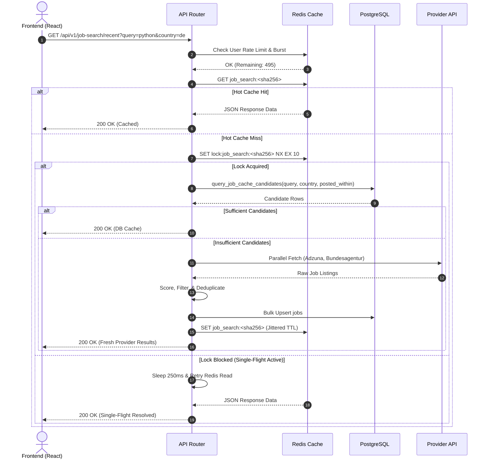

# Recent Job Search: Data Flow & Schema Reference

**Document Version:** 2.0.0  
**Status:** Approved for Production  

---

## 1. Database Schemas (PostgreSQL)

### 1.1 `jobs` Table (Shared Global Cache)

The `jobs` table acts as a multi-tool shared cache for external job postings. It stores canonicalized job details with strict expiration dates and GIN trigram indexes for fast keyword search.

```sql
CREATE TABLE jobs (
    id UUID PRIMARY KEY DEFAULT gen_random_uuid(),
    source TEXT NOT NULL,                           -- e.g., 'adzuna', 'bundesagentur', 'arbeitnow'
    source_job_id TEXT NOT NULL,                    -- Provider-native job identifier
    origin_tool TEXT NOT NULL DEFAULT 'recent_job_search', -- Feature origin tracking tag
    company_id UUID REFERENCES company_registry(id) ON DELETE SET NULL, -- Optional cross-module FK
    title TEXT NOT NULL,
    company TEXT NOT NULL,
    location TEXT NOT NULL,
    country TEXT,                                   -- ISO 2-letter country code (e.g. 'DE', 'US')
    description TEXT,
    salary_min NUMERIC,
    salary_max NUMERIC,
    category TEXT,
    apply_url TEXT NOT NULL,
    canonical_url TEXT NOT NULL,                    -- Normalized URL stripped of query tracking
    posted_at TIMESTAMP WITH TIME ZONE,
    fetched_at TIMESTAMP WITH TIME ZONE NOT NULL DEFAULT NOW(),
    last_seen_at TIMESTAMP WITH TIME ZONE NOT NULL DEFAULT NOW(),
    expires_at TIMESTAMP WITH TIME ZONE NOT NULL,
    created_at TIMESTAMP WITH TIME ZONE NOT NULL DEFAULT NOW(),
    
    CONSTRAINT jobs_source_job_id_key UNIQUE (source, source_job_id)
);
```

#### Index Architecture
- `jobs_canonical_url_idx`: B-tree index on `canonical_url`.
- `jobs_expires_at_idx`: B-tree index on `expires_at` for TTL pruning tasks.
- `jobs_country_posted_at_idx`: Compound B-tree index on `(country, posted_at DESC)` for strict country query execution.
- `jobs_title_trgm_idx`: GIN trigram index on `title gin_trgm_ops` for wildcard substring search.
- `jobs_description_trgm_idx`: GIN trigram index on `description gin_trgm_ops`.

---

### 1.2 `job_search_applications` Table (User Tracking State)

Tracks user interaction state for job postings surfaced in Recent Job Search (distinct from manual application tracking).

```sql
CREATE TABLE job_search_applications (
    id UUID PRIMARY KEY DEFAULT gen_random_uuid(),
    user_id UUID NOT NULL REFERENCES users(id) ON DELETE CASCADE,
    job_url_canonical TEXT NOT NULL,
    job_title TEXT NOT NULL,
    company_name TEXT NOT NULL,
    location TEXT NOT NULL,
    posted_at TIMESTAMP WITH TIME ZONE,
    source TEXT NOT NULL,
    application_status TEXT NOT NULL,              -- Constraint: 'saved', 'applied', 'skipped'
    tracker_application_id UUID REFERENCES job_applications(id) ON DELETE SET NULL,
    created_at TIMESTAMP WITH TIME ZONE NOT NULL DEFAULT NOW(),
    
    CONSTRAINT job_search_applications_status_check 
        CHECK (application_status IN ('saved', 'applied', 'skipped'))
);

CREATE UNIQUE INDEX job_search_applications_user_job_url_key 
    ON job_search_applications (user_id, job_url_canonical);
```

---

## 2. Redis Caching Topology

### 2.1 Hot Response Cache Keys
- **Key Schema**: `job_search:<sha256_hash>`
- **Digest Payload Input**: `query|location|country|posted_within_hours|remote_only|result_limit`
- **TTL**: Jittered 3600s +- 300s (3300s to 3900s).

### 2.2 Single-Flight Mutex Keys
- **Key Schema**: `lock:job_search:<sha256_hash>`
- **TTL**: 10 seconds.

### 2.3 Provider Budget & Rate Limiting Keys
- **User Burst Limit**: `ratelimit:burst:user_id:job_search` (Window: 5s, Max: 2 requests)
- **User Daily Quota**: `ratelimit:daily:user_id:job_search` (Window: 24h, Max: 500 requests)
- **Provider Circuit Breaker**: `circuit:adzuna`, `circuit:bundesagentur`

---

## 3. Data Flow Diagram


