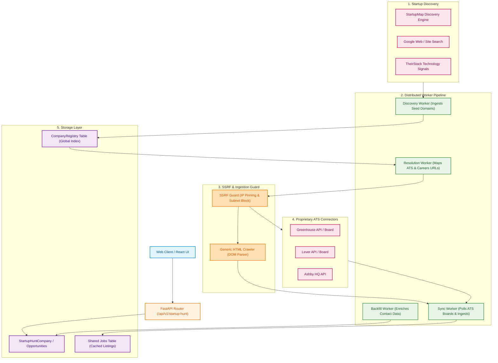
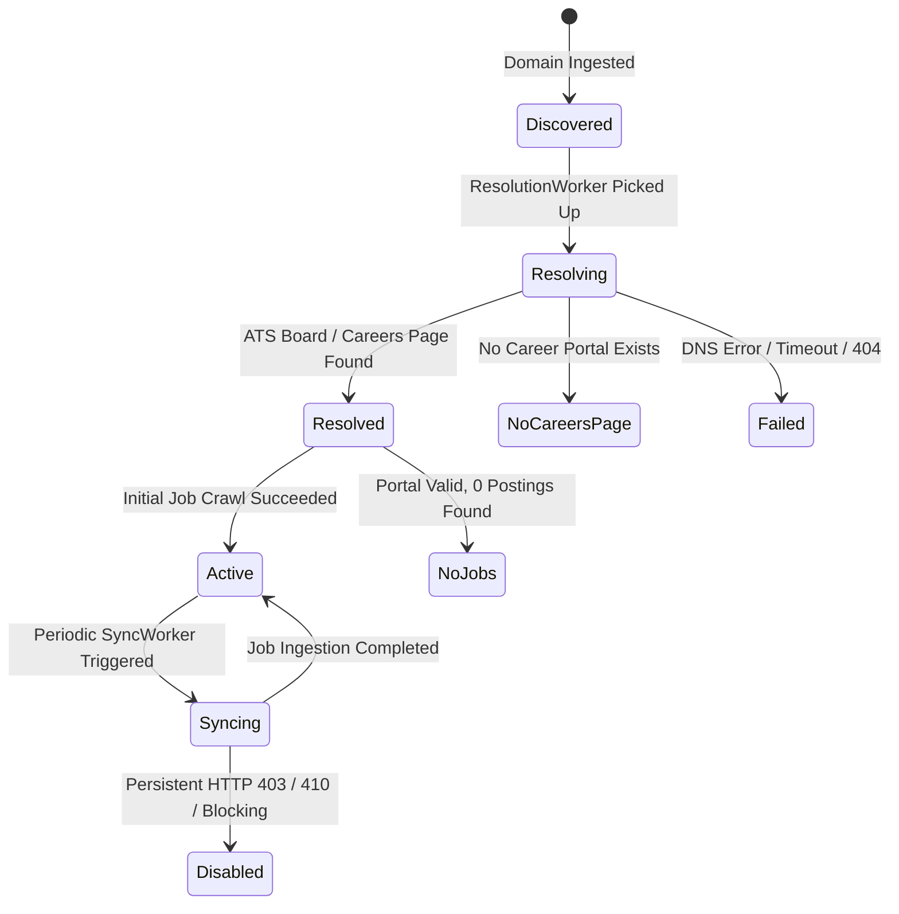

# Startup Hunt: High-Level Architecture (HLD)

**Document Version:** 2.0.0  
**Status:** Approved for Production  
**Target Audience:** Principal Architects, Lead Crawling Engineers, Backend Engineers  

---

## 1. Executive Overview

**Startup Hunt** is the automated startup discovery, ATS (Applicant Tracking System) job board resolver, and direct job vacancy ingestion engine. It discovers emerging tech startups across international directories, identifies ATS platforms (Greenhouse, Lever, Ashby, Personio, Workable, etc.), resolves career portals, and continuously ingests active job opportunities via async workers.

### Core Objectives
1. **Automated ATS Board Resolution**: Dynamically maps company domains to proprietary ATS platform endpoints or generic HTML crawler paths.
2. **SSRF Guarded Web Scraping**: Protects infrastructure against Server-Side Request Forgery via strict IP pinning, private subnet rejection (`ssrf_guard`), and HTTP header spoofing prevention.
3. **Decoupled Worker Lifecycle**: Multi-worker background pipeline (`discovery_worker`, `resolution_worker`, `sync_worker`, `backfill_worker`) backed by Celery/Redis queue.
4. **Global Company Registry**: Deduplicated canonical catalog (`CompanyRegistry`) tracking startup growth, ATS board type, crawl priority, and live vacancies.

---

## 2. System Architecture Diagram (Euclidraw Modern Style)

---

## 3. High-Level Component Breakdown

| Component | Module Location | Purpose |
| :--- | :--- | :--- |
| **Engine Orchestrator** | `engine.py` | Core 173KB orchestrator managing discovery queries, company resolution, and contact harvesting. |
| **ATS Resolver** | `ingestion/ats_resolver.py` | Inspects HTTP headers, meta tags, and URL redirects to identify ATS platform type (Greenhouse, Lever, Ashby). |
| **SSRF Guard** | `ingestion/ssrf_guard.py` | Validates target URLs before fetching; resolves DNS to reject RFC 1918 private subnets (`10.0.0.0/8`, `172.16.0.0/12`, `192.168.0.0/16`, `127.0.0.1`). |
| **Discovery Workers** | `workers/discovery_worker.py` | Ingests new startup domains into `company_registry` status `'discovered'`. |
| **Resolution Workers**| `workers/resolution_worker.py` | Processes `'discovered'` companies, executes ATS detection, advances state to `'resolved'`. |
| **Sync Workers** | `workers/sync_worker.py` | Periodically fetches active job postings for `'active'` companies and populates `jobs` cache. |
| **Contact Enricher** | `engine.py` (Phase B) | Resolves founder/CEO/CTO contacts via DuckDuckGo HTML scraping and Apollo fallback API. |

---

## 4. ATS Resolution Workflow & State Machine

