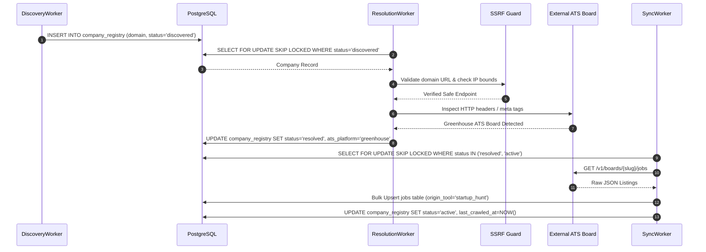

# Startup Hunt — Data Flow & Schema Reference

**Document Version:** 2.0.0  
**Status:** Approved for Production  

---

## 1. Database Schemas (PostgreSQL)

### 1.1 `company_registry` Table (Global Crawler Catalog)

Stores the global, deduplicated catalog of discovered startup companies.

```sql
CREATE TABLE company_registry (
    id UUID PRIMARY KEY DEFAULT gen_random_uuid(),
    company_name TEXT NOT NULL,
    domain TEXT,
    website_url TEXT,
    careers_url TEXT,
    ats_platform TEXT,                             -- 'greenhouse', 'lever', 'ashby', 'personio', 'workable', 'generic'
    ats_identifier TEXT,                           -- ATS board slug or API ID
    country TEXT,
    city TEXT,
    stage TEXT,                                    -- 'Seed', 'Series A', 'Series B', 'Bootstrapped', etc.
    company_size TEXT,
    status TEXT NOT NULL DEFAULT 'discovered',     -- Check constraint: 'discovered', 'resolving', 'resolved', 'active', 'no_careers_page', 'no_jobs', 'failed', 'disabled'
    crawl_priority TEXT NOT NULL DEFAULT 'normal', -- Check constraint: 'high', 'normal', 'low'
    last_crawled_at TIMESTAMP WITH TIME ZONE,
    last_job_found_at TIMESTAMP WITH TIME ZONE,
    error_count INTEGER NOT NULL DEFAULT 0,
    last_error_message TEXT,
    metadata JSONB NOT NULL DEFAULT '{}',
    created_at TIMESTAMP WITH TIME ZONE NOT NULL DEFAULT NOW(),
    updated_at TIMESTAMP WITH TIME ZONE NOT NULL DEFAULT NOW(),

    CONSTRAINT company_registry_status_check 
        CHECK (status IN ('discovered', 'resolving', 'resolved', 'active', 'no_careers_page', 'no_jobs', 'failed', 'disabled')),
    CONSTRAINT company_registry_crawl_priority_check 
        CHECK (crawl_priority IN ('high', 'normal', 'low'))
);

CREATE UNIQUE INDEX company_registry_domain_key ON company_registry(domain) WHERE domain IS NOT NULL;
CREATE INDEX company_registry_status_idx ON company_registry(status);
```

---

### 1.2 `startup_hunt_opportunities` Table (User Opportunities Snapshot)

Tracks job opportunities saved by individual users from the Startup Hunt discovery stream.

```sql
CREATE TABLE startup_hunt_opportunities (
    id UUID PRIMARY KEY DEFAULT gen_random_uuid(),
    user_id UUID NOT NULL REFERENCES profiles(id) ON DELETE CASCADE,
    company_id UUID REFERENCES startup_hunt_companies(id) ON DELETE SET NULL,
    tracker_application_id UUID REFERENCES job_applications(id) ON DELETE SET NULL,
    job_id UUID REFERENCES jobs(id) ON DELETE SET NULL,
    company_name TEXT NOT NULL,
    company_domain TEXT,
    company_website_url TEXT,
    company_careers_url TEXT,
    role_title TEXT NOT NULL,
    location TEXT NOT NULL,
    country TEXT,
    source_name TEXT NOT NULL,
    source_type TEXT NOT NULL,                     -- 'ats', 'crawler', 'theirstack', 'manual'
    direct_apply_url TEXT,
    canonical_job_url TEXT,
    posted_at TIMESTAMP WITH TIME ZONE,
    discovered_at TIMESTAMP WITH TIME ZONE NOT NULL DEFAULT NOW(),
    opportunity_kind TEXT NOT NULL DEFAULT 'job',  -- Check constraint: 'job', 'outreach_lead'
    opportunity_status TEXT NOT NULL DEFAULT 'saved', -- Check constraint: 'saved', 'applied', 'contacted', 'skipped'
    score_total NUMERIC NOT NULL DEFAULT 0,
    score_labels TEXT[] NOT NULL DEFAULT '{}',
    score_reasons TEXT[] NOT NULL DEFAULT '{}',
    citation_payload JSONB NOT NULL DEFAULT '{}',
    company_payload JSONB NOT NULL DEFAULT '{}',
    search_context JSONB NOT NULL DEFAULT '{}',
    created_at TIMESTAMP WITH TIME ZONE NOT NULL DEFAULT NOW(),
    updated_at TIMESTAMP WITH TIME ZONE NOT NULL DEFAULT NOW()
);
```

---

### 1.3 `startup_hunt_contacts` Table (Outreach Leads)

Stores contact details for founders, hiring managers, and engineers discovered for a given opportunity.

```sql
CREATE TABLE startup_hunt_contacts (
    id UUID PRIMARY KEY DEFAULT gen_random_uuid(),
    user_id UUID NOT NULL REFERENCES profiles(id) ON DELETE CASCADE,
    company_id UUID REFERENCES startup_hunt_companies(id) ON DELETE SET NULL,
    opportunity_id UUID REFERENCES startup_hunt_opportunities(id) ON DELETE CASCADE,
    name TEXT,
    title TEXT,
    contact_type TEXT,                             -- 'founder', 'recruiter', 'engineering_lead'
    email TEXT,
    email_confidence TEXT,                         -- 'high', 'medium', 'inferred'
    linkedin_url TEXT,
    source TEXT,
    provider_chain TEXT[] NOT NULL DEFAULT '{}',
    created_at TIMESTAMP WITH TIME ZONE NOT NULL DEFAULT NOW()
);
```

---

## 2. Worker Execution Sequence & Data Pipeline


