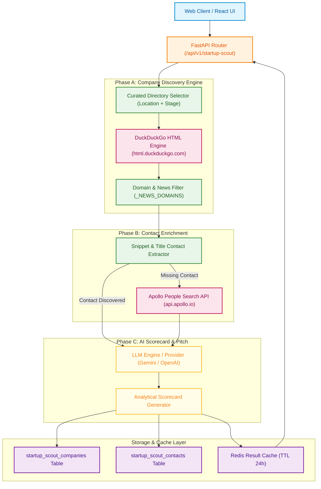
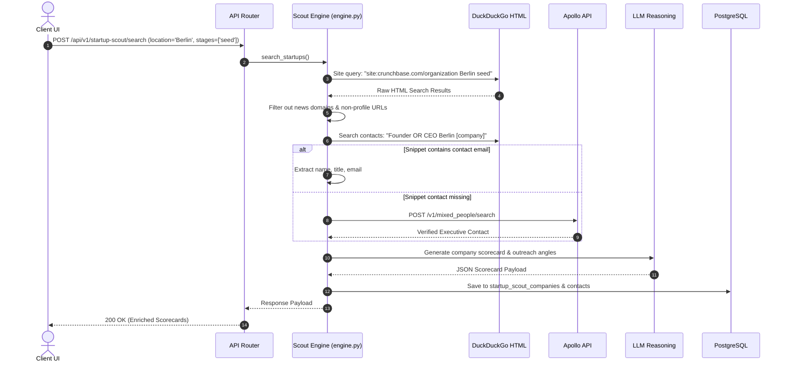

# Startup Scout — High-Level Architecture (HLD)

**Document Version:** 2.0.0  
**Status:** Approved for Production  
**Target Audience:** AI Systems Engineers, Senior Engineers, Architects  

---

## 1. Executive Overview

**Startup Scout** is an AI-powered intelligence platform that discovers early-to-growth stage technology startups, extracts company profile signals, maps executive contact details (Founders, CEOs, CTOs), and generates customized candidate outreach scorecards using LLM reasoning engines (Gemini/OpenAI).

### Core Objectives
1. **Multi-Source Ecosystem Search**: Queries DuckDuckGo HTML non-JS endpoints across curated startup directories (Crunchbase, EU-Startups, Y Combinator, TechStars, dealroom.co).
2. **Noise Filtering & Domain Blacklisting**: Filters non-company domains (news sites, job boards, blog aggregators, encylopedias) using strict pattern matching (`_NEWS_DOMAINS`, `_SKIP_URL_FRAGMENTS`).
3. **Contact Harvesting & Enrichment**: Dual-phase contact discovery utilizing search snippet regex extraction and Apollo People Search API fallback.
4. **Structured Intelligence Scorecards**: Integrates LLM reasoning (`app.ai.llm`) to generate candidate match scorecards, technology alignment breakdown, and outreach pitch angles.

---

## 2. System Architecture Diagram (Euclidraw Modern Style)

---

## 3. High-Level Component Responsibilities

| Component | File Path | Purpose |
| :--- | :--- | :--- |
| **Scout Engine** | `engine.py` | Core 76KB discovery & scraping module executing Phase A directory search and Phase B contact enrichment. |
| **Scout Service** | `service.py` | Database persistence, rate limiting checks, cache key management, and JSON response assembly. |
| **Blacklist Filter** | `engine.py` | Enforces `_NEWS_DOMAINS` (90+ press sites) and `_SKIP_URL_SEGMENTS` to reject articles and retain actual startup profiles. |
| **Apollo Connector** | `engine.py` | Calls Apollo API to fetch verified email addresses and LinkedIn URLs when search snippets lack direct contact details. |
| **LLM Reasoning Adapter**| `app/ai/llm.py` | Generates analytical company summaries, hiring momentum signals, and outreach messaging hooks. |

---

## 4. Multi-Phase Processing Sequence

